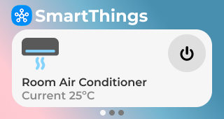
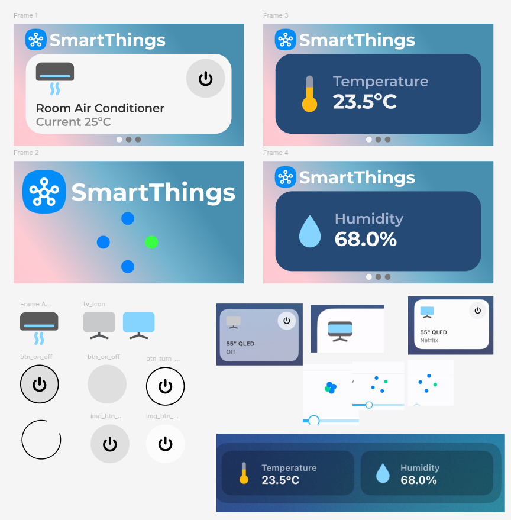

# LVGL ESP32 SmartThings Controller



An LVGL application for controlling Samsung SmartThings devices using Lilygo T-Display S3 and ESP-IDF.

Supported devices: Smart TV and Air Conditioner. Support for other devices can be added.

It also shows average temperature and humidity.

## Design

The design was heavily inspired on the SmartThings iOS app. Assets and prototype were made in Figma and Inkscape.



## Requirements

- Samsung SmartThings API Token

Visit SmartThings website [https://account.smartthings.com/tokens](https://account.smartthings.com/tokens). Login with your samsung account and generate an API token.

- Create .env file

On project root, create `.env` file with WiFi SSID and password, and Samsung SmartThings API token
```
WIFI_SSID="YourSSID"
WIFI_PASSWORD="YourPass"
SMARTTHINGS_API_TOKEN="12345-your-token-here-6789"
```

The root CMakeLists.txt will pick up those values and add to the application.

## Reference commands

- Converting lottie json to .h header

```
cd main/ui/assets
python3 ../../../../managed_components/lvgl__lvgl/scripts/filetohex.py ac_on.json --filter-character --null-terminate > ac_on_json.h
```

- Edit the .h header to add consts and 0x00 (nul termination)  
(filetohex.py from managed components differs from main lvgl repo, so '--filter-character --null-terminate' are not implemented)
```
const uint8_t ac_on_json[] = {
    0x00
};
const size_t ac_on_json_size = sizeof(ac_on_json);
```

- Generate certificates for smartthings api
```
openssl s_client -showcerts -connect api.smartthings.com:443 </dev/null | awk '/BEGIN/,/END/{ print $0 }' > main/api/certs/smartthings_root_cert.pem
```
